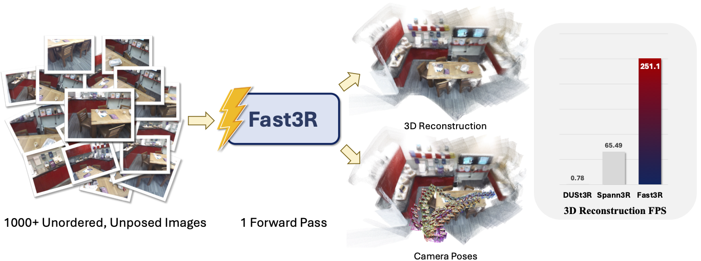

<div align="center">

# Fast3R - Towards 3D Reconstruction of 1000+ Images in One Forward Pass

[](https://arxiv.org/abs/2501.13928)
[](https://fast3r-3d.github.io/)
[](https://huggingface.co/spaces/your-placeholder)

</div>



Official implementation of **Fast3R - Towards 3D Reconstruction of 1000+ Images in One Forward Pass**

*[Jianing Yang](https://jedyang.com/), [Alexander Sax](https://alexsax.github.io/), [Kevin J. Liang](https://kevinjliang.github.io/), [Mikael Henaff](https://www.mikaelhenaff.net/), [Hao Tang](https://tanghaotommy.github.io/), [Ang Cao](https://caoang327.github.io/), [Joyce Chai](https://web.eecs.umich.edu/~chaijy/), [Franziska Meier](https://fmeier.github.io/), [Matt Feiszli](https://www.linkedin.com/in/matt-feiszli-76b34b/)*

## Installation

```bash
# clone project
git clone https://github.com/facebookresearch/fast3r
cd fast3r

# create conda environment
conda create -n fast3r python=3.11 cmake=3.14.0
conda activate fast3r

# install PyTorch (adjust cuda version according to your system)
conda install pytorch torchvision torchaudio pytorch-cuda=12.4 -c pytorch -c nvidia

# Install PyTorch3D from source (the compilation will take a while)
pip install "git+https://github.com/facebookresearch/pytorch3d.git@stable"

# install requirements
pip install -r requirements.txt
```

<details>
<summary>Installation Troubleshooting</summary>

If you encounter the error `fatal error: cuda_runtime.h: No such file or directory` when installing PyTorch3D, try setting `CUDA_HOME` before installing PyTorch3D:

```bash
export CUDA_HOME=/usr/local/cuda-12.4
pip install "git+https://github.com/facebookresearch/pytorch3d.git@stable"
```
</details>

## Inference and Demo

To run the demo, you need to download the pre-trained model weights and config from [here](https://placeholder.zip), unzip it, and place it in the `checkpoints` directory.

```bash
python src/viz/demo.py --checkpoint_dir checkpoints/fast3r_large
```

This will launch a Gradio interface where you can upload images and visualize the 3D reconstruction and camera pose estimation.

`src/viz/demo.py` also serves as an example of how to use the model for inference.

## Training

Train model with chosen experiment configuration from [configs/experiment/](configs/experiment/)

```bash
python src/train.py experiment=super_long_training/super_long_training
```

You can override any parameter from command line following [Hydra override syntax](https://hydra.cc/docs/advanced/override_grammar/basic/):

```bash
python src/train.py experiment=super_long_training/super_long_training trainer.max_epochs=20 trainer.num_nodes=2
```

To submit a multi-node training job with Slurm, use the following command:

```bash
python scripts/slurm/submit_train.py --nodes=<NODES> --experiment=<EXPERIMENT>
```

## Evaluation

To evaluate on 3D reconstruction or camera pose estimation tasks, run:

```bash
python src/evaluate.py eval=<eval_config>
```
`<eval_config>` can be any of the evaluation configurations in [configs/eval/](configs/eval/). For example:
- `ablation_recon_better_inference_hp/ablation_recon_better_inference_hp` evaluates the 3D reconstruction on DTU, 7-Scenes and Neural-RGBD datasets.
- `eval_cam_pose/eval_cam_pose_10views` evaluates the camera pose estimation on 10 views on CO3D dataset.


To evaluate camera poses on RealEstate10K dataset, run:

```bash
python scripts/fast3r_re10k_pose_eval.py  --subset_file scripts/re10k_test_1800.txt
```

To evaluate multi-view depth estimation on Tanks and Temples, ETH-3D, DTU and ScanNet datasets, follow the data download and preparation guide of [robustmvd](https://github.com/lmb-freiburg/robustmvd), install that repo's `requirements.txt` into the current conda environment, and run:

```bash
python scripts/robustmvd_eval.py
```

## License

See [LICENSE](LICENSE) for details.
```
Copyright (c) Meta Platforms, Inc. and affiliates.
All rights reserved.

This source code is licensed under the license found in the
LICENSE file in the root directory of this source tree.
```


## Contributing

See [contributing](CONTRIBUTING.md) and the [code of conduct](CODE_OF_CONDUCT.md).

## Citation

```
@misc{yang2025fast3r,
      title={Fast3R: Towards 3D Reconstruction of 1000+ Images in One Forward Pass}, 
      author={Jianing Yang and Alexander Sax and Kevin J. Liang and Mikael Henaff and Hao Tang and Ang Cao and Joyce Chai and Franziska Meier and Matt Feiszli},
      year={2025},
      eprint={2501.13928},
      archivePrefix={arXiv},
      primaryClass={cs.CV},
      url={https://arxiv.org/abs/2501.13928}, 
}
```

## Acknowledgement

Fast3R is built upon a foundation of remarkable open-source projects. We deeply appreciate the contributions of these projects and their communities, whose efforts have significantly advanced the field and made this work possible.

- [DUSt3R](https://dust3r.europe.naverlabs.com/)
- [Spann3R](https://hengyiwang.github.io/projects/spanner)
- [Viser](https://viser.studio/main/)
- [Lightning-Hydra-Template](https://github.com/ashleve/lightning-hydra-template)
